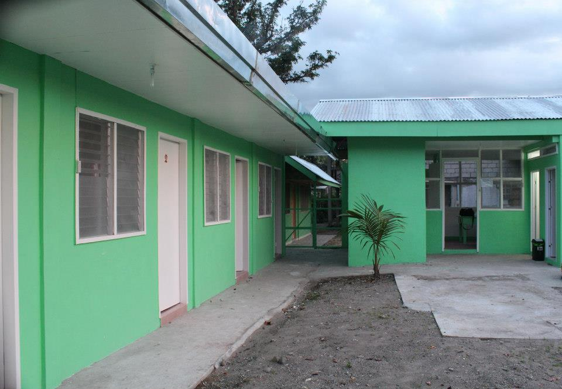
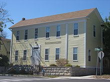

# Readme week10

Name: **Boarding House Management**

---
#### Description: 

        This project "Borading House Management" is about managing the records that is related to boarding house, these records are waterbills, electricbills, monthly bills, payments, and etc. The Boarding House Management is currently a concept for now and will be conducted/created soon.
---
Visuals:

---
Installations: 

                    _not yet done_

---

Author:

---

>___Liberty M. Vasquez___
##      
---
###### A little message from the author:
###### The project is currently a concept and is on the process of making it as a web application, I apologize if it will be conducted or to be published late than the expected date, but rest assured that even when it is late, I am learning and still on the process to develop websites and programming. :smile: Also, The visuals are only filler and it is not the actual visual of neither the website nor the literal boarding house. Good Day and I hope you have a wonderful day. Do not lose hope no matter what! Every day is a new day so make the best of it! :innocent: :heart: :angel: :angel: :angel: :angel: :angel: :heart::heart: